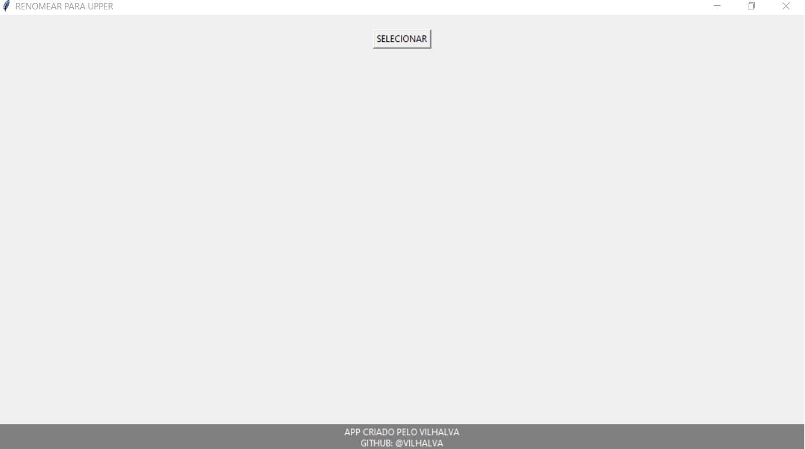

# RENOMEAR UPPER
🎈RENOMEIE SEUS ARQUIVOS PARA UPPER.

  

## O QUE ELE FAZ?
Este é um simples executável feito em Python que permite renomear todos os arquivos em um diretório para letras maiúsculas e substituir espaços por sublinhados. Essa ferramenta pode ser útil para padronizar nomes de arquivos em um diretório.

## COMO USAR?
1. Execute o programa Python em um ambiente que suporte a interface gráfica Tkinter.
2. Clique no botão "Selecionar Diretório" para escolher o diretório contendo os arquivos que você deseja renomear.
3. Após selecionar o diretório, o programa renomeará automaticamente todos os arquivos no diretório para letras maiúsculas e substituirá espaços por sublinhados.
4. Uma mensagem informará se a operação foi concluída com sucesso ou se ocorreu algum erro.

